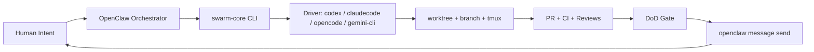

<div align="center">

# OPENCLAW SWARM CORE
### PRIVATE EDITION // DELIVERY OS

<p>
  
  
  
  
</p>

<p><strong>One human. Many agents. Deterministic shipping.</strong></p>

</div>

---

## Why This Exists

`openclaw-swarm-core` is a reusable swarm control plane.

It gives every repo the same hardened runtime:
- deterministic task state machine
- multi-driver execution (`codex`, `claudecode`, `opencode`, `gemini-cli`)
- SQLite truth source + JSON compatibility projection
- OpenClaw-native notifications (`openclaw message send`)
- thin per-project wrappers via `swarm seed`

---

## Swarm Kill Chain

| Stage | Owner | Output |
|---|---|---|
| Intent | Human | feature/bug instruction |
| Orchestration | OpenClaw | scoped task + selected driver |
| Execution | Driver + worktree + tmux | commits + branch + PR attempt |
| Deterministic Monitor | `swarm monitor tick` | state updates + retries + gates |
| Gate | DoD checks | `ready_to_merge` or failure path |
| Notification | OpenClaw message layer | Discord update to human |

---

## 90-Second Install

```bash
git clone https://github.com/20XCOMPANY/openclaw-swarm-core.git
cd openclaw-swarm-core
./install.sh --yes --link-bin
```

Installer behavior:
- deploy runtime into `~/.openclaw/swarm-core`
- backup previous install as `.bak.<timestamp>`
- optionally link `~/.local/bin/swarm` to runtime binary

Verify:

```bash
swarm --help
# or
~/.openclaw/swarm-core/swarm --help
```

---

## Bootstrap Any Repository

```bash
swarm seed --repo /abs/path/to/repo
```

Seed generates project `.openclaw/` wrappers:
- `spawn-agent.sh`
- `redirect-agent.sh`
- `check-agents.sh`
- `status.sh`
- `cleanup.sh`

---

## Command Deck

```bash
# 1) Spawn
./.openclaw/spawn-agent.sh \
  --id "task-$(date +%s)" \
  --agent codex \
  --prompt "ship feature X"

# 2) Mid-flight correction
./.openclaw/redirect-agent.sh <task-id> "focus API first then UI"

# 3) Deterministic monitor loop
./.openclaw/check-agents.sh

# 4) Inspect and cleanup
./.openclaw/status.sh --json
./.openclaw/cleanup.sh
```

---

## Architecture At Full Throttle



---

## Driver Matrix

| Driver | Primary Use | Default Model | Notes |
|---|---|---|---|
| `codex` | backend, complex reasoning | `gpt-5.3-codex` | default driver |
| `claudecode` | frontend, rapid iteration | `claude-sonnet-4-6` | `claude` alias supported |
| `opencode` | OpenCode flows | `openai/gpt-5.3-codex` | provider/model must exist |
| `gemini-cli` | Gemini CLI execution | `gemini-2.5-pro` | auth required |

`gemini-cli` can be toggled per project:

```toml
[drivers.gemini-cli]
model = "gemini-2.5-pro"
reasoning = "high"
enabled = true
```

---

## Notification Path

Notifications are sent by OpenClaw itself, not raw webhook scripts.

- sender: `openclaw message send`
- config location: project `.openclaw/project.toml` -> `[notifications]`
- recommended events: `ready_to_merge`, `merged`, `abandoned`

---

## Upgrade Protocol

```bash
cd openclaw-swarm-core
git pull
./install.sh --yes --link-bin
```

---

## Repo Structure

- `swarm-core/` runtime core
- `reference/` architecture, constitution, usage
- `install.sh` one-command agent installer

---

## Reading Order

1. `reference/agent-swarm-usage.md`
2. `reference/agent-swarm-architecture.md`
3. `reference/agent-swarm-constitution-v1.md`
