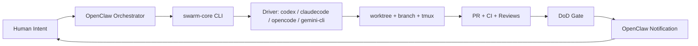

# OPENCLAW SWARM CORE // PRIVATE EDITION

> One human  
> Many agents  
> Zero script copy-paste hell

This repo is a reusable Delivery OS for OpenClaw.

It gives every project the same hardened swarm core:
- deterministic task state machine
- multi-driver execution (`codex`, `claudecode`, `opencode`, `gemini-cli`)
- SQLite truth source + JSON compatibility projection
- OpenClaw-native notifications (`openclaw message send`)
- project seeding via `swarm seed`

## Architecture At 10,000 RPM



## 90-Second Install

```bash
git clone https://github.com/20XCOMPANY/openclaw-swarm-core.git
cd openclaw-swarm-core
./install.sh --yes --link-bin
```

Installer behavior:
- deploys runtime to `~/.openclaw/swarm-core`
- creates backup if existing install is present (`.bak.<timestamp>`)
- links `~/.local/bin/swarm` when `--link-bin` is enabled

## Verify It Is Alive

```bash
swarm --help
# or
~/.openclaw/swarm-core/swarm --help
```

## Seed Any Project

```bash
swarm seed --repo /abs/path/to/repo
```

Generated wrappers in project `.openclaw/`:
- `spawn-agent.sh`
- `redirect-agent.sh`
- `check-agents.sh`
- `status.sh`
- `cleanup.sh`

## Operator Cheatcodes

```bash
# Spawn
./.openclaw/spawn-agent.sh --id "task-$(date +%s)" --agent codex --prompt "ship feature X"

# Correct direction mid-flight
./.openclaw/redirect-agent.sh <task-id> "focus API first then UI"

# Deterministic monitor tick
./.openclaw/check-agents.sh

# Status / cleanup
./.openclaw/status.sh --json
./.openclaw/cleanup.sh
```

## Driver Rules

- default project driver: `codex`
- `claude` alias -> `claudecode`
- `gemini-cli` is executable and can be toggled per project

```toml
[drivers.gemini-cli]
model = "gemini-2.5-pro"
reasoning = "high"
enabled = true
```

## Notification Rules

Notifications are sent by OpenClaw itself, not raw webhook scripts.
- sender path: `openclaw message send`
- configured in each project `.openclaw/project.toml` under `[notifications]`

## Upgrade

```bash
cd openclaw-swarm-core
git pull
./install.sh --yes --link-bin
```

## Repo Layout

- `swarm-core/` runtime core
- `reference/` usage + architecture + constitution
- `install.sh` self-install for agents

## Read Before Extending

- `reference/agent-swarm-usage.md`
- `reference/agent-swarm-architecture.md`
- `reference/agent-swarm-constitution-v1.md`
