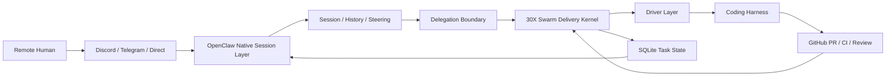

<!--
[INPUT]: 依赖 OpenClaw 原生能力验证结果，依赖 swarm-core 当前实现与使用约定
[OUTPUT]: 对外提供 30X Swarm x OpenClaw 协同架构说明与链路分层
[POS]: reference 的架构说明文档，连接 north-star、constitution 与 usage
[PROTOCOL]: 变更时更新此头部，然后检查 AGENTS.md
-->

# 30X Swarm Architecture

Status: Current  
Scope: OpenClaw-native conversational delivery

## 1. Core Framing

当前系统不是“OpenClaw 外挂一个 swarm 脚本”，而是一个两层协同系统：

- **OpenClaw 原生会话层**：远程入口、持续对话、会话历史、steering、状态追问、子会话派生
- **30X Swarm 交付内核**：任务状态机、driver 调度、PR/CI/review gate、重试、清理

它们之间的关系不是替代，而是分工：

- OpenClaw 负责理解和持续承接人类意图
- swarm 负责让交付过程在机器侧可控、可监控、可恢复

## 2. Why This Split Exists

如果把业务意图、多轮澄清、历史记忆、远程消息和代码执行塞进同一个执行器，会同时出现两种退化：

- 对话系统缺少确定性交付约束，容易停在“回答得像完成了”
- 代码执行器缺少会话连续性，容易把每次补充要求当成新任务

分层之后：

- OpenClaw 保存对话连续性与业务语义
- swarm 保存交付确定性与机器可验证状态
- coding harness 只负责高质量执行，不背负业务控制面

## 3. Native OpenClaw Abilities The Architecture Depends On

当前架构明确建立在这些已验证的 OpenClaw 原生能力上：

- `agent` / `agents`
- `sessions` / `sessions_history` / `sessions_send` / `sessions_yield`
- `session_status`
- `sessions_spawn`
- `subagents`
- `message`
- `acp`
- agent runtime tools: `read/edit/write/exec/process`

因此系统并不需要伪造一个“未来有会话能力”的 OpenClaw；地基今天就存在。

## 4. Runtime Topology

## 5. Conversational Delivery Chain

标准链路不是 `spawn -> PR`，而是：

`conversation -> clarify -> delegate -> execute -> monitor -> steer/retry -> ready_to_merge -> merge`

这里的关键点有三个：

1. **Conversation is primary**
- 用户看到的是 OpenClaw 会话，不是 `tmux`

2. **Delegation is explicit**
- OpenClaw 将意图委托给 swarm，而不是把 swarm 暴露成用户产品面

3. **Delivery is artifact-backed**
- 交付完成的标志是 PR/gates/state，不是 agent 说“我做完了”

## 6. Responsibility Split

### OpenClaw
- 接收远程需求
- 保持会话上下文
- 支持多轮补充、打断、继续推进
- 回答任务状态
- 选择何时委托给 swarm

### swarm
- 创建隔离执行上下文
- 选择和驱动 coding harness
- 建立 PR 产物链路
- 通过外部信号做监控与重试
- 向 OpenClaw 提供可查询交付状态

### Coding Harness
- 遵守 prompt 和 DoD
- 在隔离工作区执行实现
- 生成提交、分支、PR 与必要工件

## 7. Why Swarm Still Matters

即使 OpenClaw 已有原生 coding tool delegation，swarm 依然有独立价值：

- 它把执行行为做成了稳定协议
- 它把 PR/CI/review/screenshot gate 做成了确定性状态机
- 它把失败重试做成了 evidence-driven loop
- 它把不同 coding harness 收口成统一交付接口

所以 swarm 的护城河不是“能调某个 CLI”，而是：

**能把持续对话中的业务意图稳定收敛成生产级 PR。**

## 8. Architectural Consequences

这套架构意味着：

- 不应把更多 CLI 支持误当作北极星
- 不应把 OpenClaw 降级成单纯消息入口
- 不应让每次补充要求都新开一个独立任务
- 应优先建设 OpenClaw session 与 swarm task 的稳定映射
- 应优先建设 interruption / continue / status query 的正式路径

[PROTOCOL]: 变更时更新此头部，然后检查 AGENTS.md
